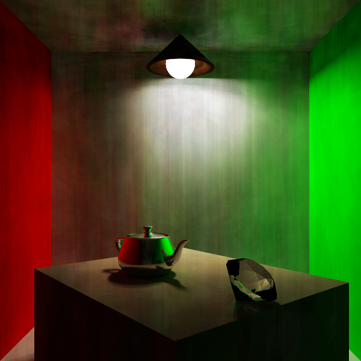
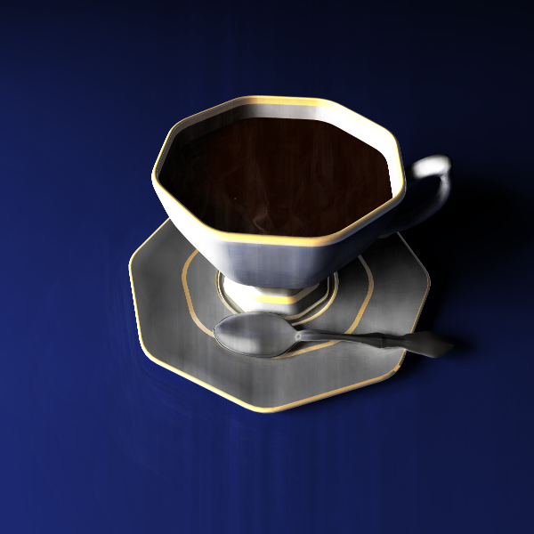
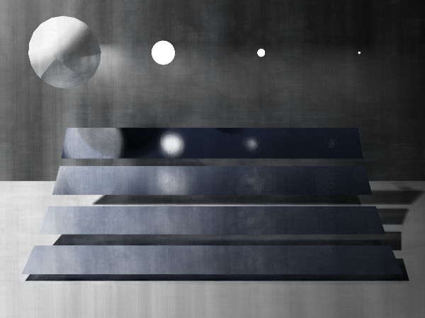
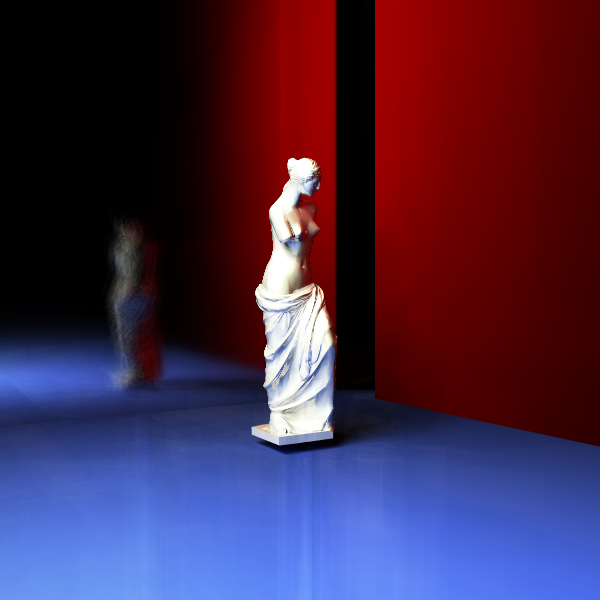

# MonteCarloPathTracing
* 运行环境
* 结果

## 运行环境
* Windows
* VS2017 Release X64

## 结果
### 场景 1 room
* 长宽：600*600
* 相机：位置 = [0,0,4]，lookat视点 = [0,0,0]，up上方向 = [0,1,0]，fov视场角 = 50
* 照明：一个圆形照明，位置 = [0.0,1.589,-1.274]，半径 = 0.2，辐射值Le = [50,50,40] 

### 场景 2 cup
* 长宽：600*600
* 相机：位置 = [0,0.64,0.52], lookat视点 = [0,0.4,0.3]，up上方向 = [0,1,0]，fov视场角 = 60
* 照明：一个方形照明，位置 = [-2.758771896,1.5246,0.0]，长宽 = 1.5 * 2，辐射值Le = [40,40,40] 

### 场景 3 Veach MIS
* 长宽：600*450
* 相机：位置 = [0,2.0,15.0], lookat视点 = [0,1.69521,14.0476]，up上方向 = [0,0.952421,-0.304787]，fov视场角 = 40
* 照明：五个圆形照明 
(位置 = [-10,10,4]，半径 = 0.5，辐射值Le = [800,800,800]) 
(位置 = [3.75,0,0]，半径 = 0.033，辐射值Le = [901.803,901.803,901.803]) 
(位置 = [1.25,0,0]， 半径 = 0.1，辐射值Le = [100,100,100]) 
(位置 = [-1.25,0,0]，半径 = 0.3，辐射值Le = [11.1111,11.1111,11.1111]) 
(位置 = [-3.75,0,0]，半径 = 0.9， 辐射值Le = [1.23457, 1.23457, 1.23457]) 

### 场景 4 venus
* 长宽：600*600
* 相机：位置 = [-1.2,0.0,2.00],lookat视点 = [0,0,0]，up上方向 = [0,1,0]，fov视场角 = 50
* 照明：一个方形照明, 位置 = [-2.058771896,1.5246,0.0], 长宽 = 1.5 * 2, 辐射值Le = [50,50,40] 

